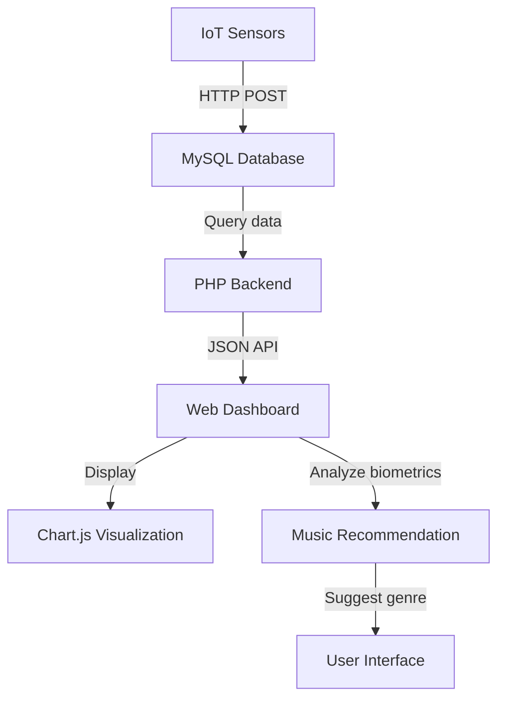
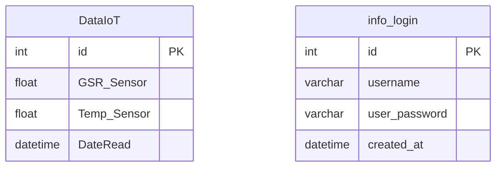

# Mesura Web - Biometric music recommendation system

Web application that analyzes biometric sensor data (GSR and temperature) in real-time to recommend music genres matching the user's emotional and physical state.

**Related project:** [Mesura Firmware](https://github.com/CoKeFish/mesura-firmware) - IoT sensor implementations for Arduino, ESP32, and Raspberry Pi.

## What it does

Mesura collects biometric data from IoT sensors and uses it to:
- Visualize sensor readings in real-time with interactive charts
- Analyze GSR (Galvanic Skin Response) to detect stress/relaxation levels
- Monitor temperature variations
- Recommend music genres based on the user's current biometric state

## How it works



## Technologies used

### Backend
- PHP 7.4+
- MySQL 5.7+ 

### Frontend
- HTML5, CSS3, JavaScript (ES6+)
- Bootstrap 5.2.1
- Chart.js 3.9.1
- AJAX for real-time updates

## Database schema



## API endpoint

**GET** `/json_enco.php` - Returns sensor data in JSON format

```json
{
  "GSR_Sensor": [523.5, 487.2, 501.8],
  "Temp_Sensor": [25.3, 24.8, 25.1],
  "DateRead": ["2022-10-15 10:30:00", "2022-10-15 10:31:00", ...]
}
```

## Demo

A static demo version is available on the `demo` branch with simulated data for portfolio presentation.

## Author

**Rodion Romanovich Tabares Correa**

IoT Class Project - 2022
